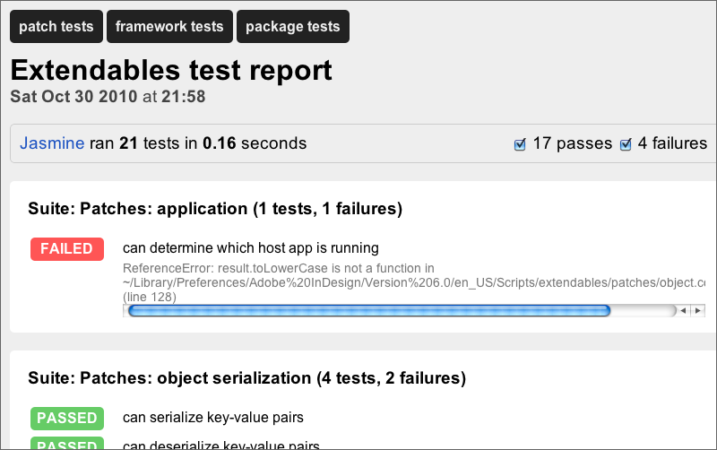

.. _testing:

=========================================
``testing``: unit testing in ExtendScript
=========================================

Extendables comes with `Pivotal Labs <http://pivotallabs.com/>`_' excellent Jasmine unit-testing framework, ever-so-slightly modified to make it work with ExtendScript. Jasmine defines a very intuitive domain-specific language on top of Javascript:

.. code-block:: javascript

    describe('Calculator', function () {
      var counter = 0
    
      it('can add a number', function () {
        counter = counter + 2;   // counter was 0 before
        expect(bar).toEqual(2);
      });
    
      it('can multiply a number', function () {
        counter = counter * 5;   // counter was 2 before
        expect(bar).toEqual(10);
      });
    });

You can `read the documentation to Jasmine <http://pivotal.github.com/jasmine/>`_ at GitHub.

Where to place tests
====================

A test suite is simply a Javascript file which calls ``describe``. Conventionally, tests are placed inside ``/path/to/module/test/*.specs``. If you follow this convention, Extendables will find and run your tests as part of its built-in test suite. The test runner is located at ``tools/testrunner.jsx`` in the Extendables project root.

Running tests
=============

You don't need to use the Extendables test runner if you don't want to, or if you want to test a script that isn't a registered CommonJS module.

Try this instead: 

.. code-block:: extendscript

    #include "extendables/extendables.jsx"
    // extracts describe, it, expect etc. into the global namespace
    extract("testing");
    describe('My test suite', function () { /* your tests here */ });
    tests.to_html("tests.mytestsuite.html");
    // or alternatively: tests.to_console();

HTML test results will reside under ``log`` in the Extendables project root.

.. note::

    While it's usually not a good idea to extract an entire module into the global namespace, ``testing`` is the exception. It would be very tiresome to prefix every ``expect``, ``it``, ``describe`` etc. with a namespace, so we don't. To avoid polluting the global namespace of our script, test runners and specs are usually a separate script, rather than part of the script itself.