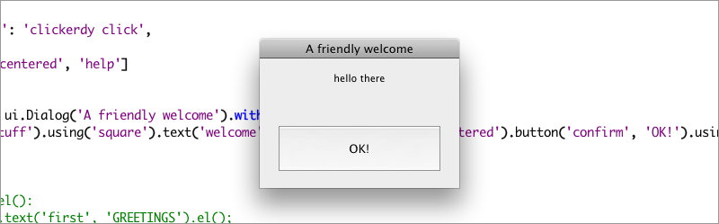

========================
``ui``: The UI framework
========================

Creating a UI
=============

It's easiest to get acquainted with the UI mini-framework through an example. Here's what a finished interface may look like: 

.. literalinclude:: ../../../examples/ui.jsx
   :language: extendscript

And visually: 

Every UI consists of three parts: 

1. **a skeleton**: the basic structure and layout of a dialog or palette
2. **stylings**, like applying width and height to elements, or giving them a different color
3. **event handlers** that bring your UI alive

Extendables UI makes it painless to keep these three parts separate, giving your project a `Model-View-Controller <http://en.wikipedia.org/wiki/Model–View–Controller>`_-like vibe.

Let's build this example up from scratch.

Creating an interface
---------------------

First, we need to call the UI library, using :func:`require`, and create a dialog. Dialogs usually come with a title, in this case ``A friendly welcome``.

.. code-block:: javascript

    var ui = require("ui");
    var dialog = new ui.Dialog('A friendly welcome');

Adding controls and groups
--------------------------

Once we've created our bare dialog, we should add some controls. It's often best to add controls under a group. A group can be either a ``column``, a ``row`` or a ``stack``. Here, we arrange the controls in a column.

For each control, specify a variable name and the text it should display, if any. We add a variable name so we can reference each individual control later on, in case we want to add some events or change things around.

.. code-block:: javascript

    dialog.column('stuff')
    	.text('welcome', 'hello there')
    	.button('confirm', 'OK!');

It's best not to construct an entire layout on a single line. Javascript can handle line breaks in between chained method calls just fine, and it makes things more readable.

We can chain controls together, like we did above, but we could also specify each control individually, or a couple at a time. If we do so, we can make use of the fact that each control is assigned to a variable. In this case, our column is available through ``dialog.stuff``.

.. code-block:: javascript

    dialog.column('stuff');
    dialog.stuff.text('welcome', 'hello there');
    dialog.stuff.button('confirm', 'OK!');

.. seealso::

   You'll find a reference of all element types (button, dropdown, etc.) and group types (row, column, stack) at :ref:`ui-reference`
   
Adding element properties and styling
-------------------------------------

At this point, we'll want to style our dialog a bit, so it looks a bit nicer.

Styles are specified with what we call ``mixins`` because they are properties that we'll *mix* in with our control objects. Each style has a name.

.. code-block:: javascript

    var mixins = {
    	'centered': {
    		'size': [180, 50],
    		'justify': 'center'
    	},
    	'help': {
    		'helpTip': 'clickerdy click'
    	}
    };
    
Mixin properties correspond one-to-one with properties that are available on the control element you wish to style. For example, each ScriptUI ``Button`` object, and most other controls for that matter, have a ``size`` property, and we can change that size by adding an array of the form ``[width, height]`` to one of our mixins.

Of course, we still have to apply those styles to the controls we want to style.

First, we need to signal our dialog that we have a couple of mixins we'd like to use to style the dialog. That's done using the ``with`` method on our dialog, when we create it. So let's revise our code as follows: 

.. code-block:: javascript

    var ui = require("ui");

    /* styles */
    var mixins = {
    	'centered': {
    		'size': [180, 50],
    		'justify': 'center'
    	},
    	'help': {
    		'helpTip': 'clickerdy click'
    	}
    };

    var dialog = new ui.Dialog('A friendly welcome').with(mixins);
    
    dialog.column('stuff')
    	.text('welcome', 'hello there')
    	.button('confirm', 'OK!');

Now, all that's left to do, is applying the mixins we defined earlier to control elements of our choosing. We can apply a mixin with the ``using`` method.

.. code-block:: javascript

    dialog.column('stuff').using('square')
    	.text('welcome', 'hello there').using('centered')
    	.button('confirm', 'OK!');

Combinations of mixins
----------------------

It's also possible to create styles that are a combination of other styles. Style combinations can make your layout definition less verbose. If we apply ``button`` to a control, it'll receive both the styles from ``centered`` and those from ``help``.

.. code-block:: javascript
    dialog.mixins.fancy_button = ['centered', 'help'];
    dialog.stuff.confirm.using('fancy_button');

Why use mixins?
---------------

The follow code snippets are equal: 

.. code-block:: javascript
    
    // with plain assignment...
    dialog.stuff.welcome.size = [180, 50];
    dialog.stuff.welcome.justify = 'center';
    
    // ... or using a mixin
    dialog.stuff.welcome.using('centered');
    
Mixins are handy because they make it possible to re-use a certain style for different control objects, without having to type the same assignments over and over again.

Just as important, mixins allow us to define how we want to style our dialog entirely separate from how it's structured and which controls it contains. This separation will make your code easier to understand.

Adding event listeners
----------------------

We've created a little dialog now. At the very least, we want to be able to close that dialog. We can do that by adding an event listener that jumps into action when we click the OK! button.

As a quick reminder: control elements are accessible through the first argument specified on their construction. The button in ``dialog.row('a_row').button('a_button', 'Click here);`` is accessed through ``dialog.a_row.a_button``. Earlier, we gave our OK! button the name ``confirm``, and placed it under the ``stuff`` column, so we'll access that control element with ``dialog.stuff.confirm``.

.. code-block:: extendscript

    // add an event, Extendables-style
    dialog.stuff.confirm.on(event_type).do(handler);

    // but you can still add an event the old way, if you prefer
    dialog.stuff.confirm.addEventListener(event_type, handler);
    
    // here's a practical example
    dialog.stuff.confirm.on('click').do(function () {
        this.window.close();
    });

Avoid adding an event handler through ``control.onClick = handler``; it will push any previous handlers on the control.

.. seealso::

   You'll find a reference of all event types (click, mouseover etc.) at :ref:`ui-reference`

Putting everything together
---------------------------

We've 

 * created a dialog
 * added a column group and a couple of controls
 * specified some mixins which specify how we want to style something
 * added those mixins to the dialog (``dialog.with``) and applied them
   to a couple of elements (``control.using``)
 * added an event to a button, so we can close our dialog

There's one last thing: we still need to show our dialog. Add ``dialog.window.show()`` to the bottom of your script, and we're done.

The end result is the code we showed at the top of this page: 

.. literalinclude:: ../../../examples/ui.jsx
   :language: extendscript
   
You'll find this exact script at ``extendables/examples/ui.jsx``. You can copy-paste this file elsewhere and use it as a starting point to learn more about creating user interfaces with the Extendables UI library.

What's wrong with a GUI designer?
=================================

Software like Steven Bryant's `Rapid ScriptUI <http://scriptui.com/>`_ or the `ScriptUI Interface Builder <http://www.scriptuibuilder.com/>`_ give you a nice graphical interface in which to build a ScriptUI user interface. If a graphical approach is what you prefer, by all means, stick to it. However:

1. When you need to make a UI programmatically, GUI builders won't help.
2. GUI builders fix a symptom (ScriptUI coding is very verbose and sometimes tough), our approach fixes the problem.